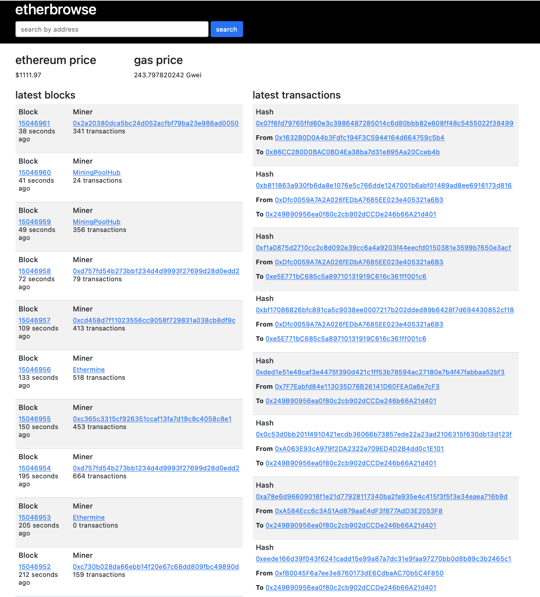

# testbench-web3py-etherscan
Testbench and Sandbox Repository to develope a working understanding of Blockchain Development

## Build your own Etherscan with web3.py

### Before you run it

#### Option 1: Connect to Ethereum Mainnet
In order to run the code, you need to have a (Free) account created at https://infura.io/
Once you have an account: 
- Create New Project; 
    - Under "Product" select "Ethereum"
    - Enter any "Project Name"
- Copy the Endpoint URL that looks like this https://mainnet.infura.io/v3/xxxxxxxxxxxxxxxxxxxxxxxxxxxxxxxx
- Create a .env file and store INFURA_URL = "https://mainnet.infura.io/v3/xxxxxxxxxxxxxxxxxxxxxxxxxxxxxxxx" and save the file

#### Option 2: Connection to Ganache Localhost
- Download and install the Ganache for your Operating System from https://trufflesuite.com/ganache/
- Run a local Blockchain RPC Server and connect to it

### Run it

pip3 install -r requirements.txt

export FLASK_APP=app

export FLASK_ENV=development

flask run

### Screenshot:

### Reference: 

- https://www.geeksforgeeks.org/how-to-set-up-ganche-with-metamask
- https://trufflesuite.com/ganache/
- https://infura.io/